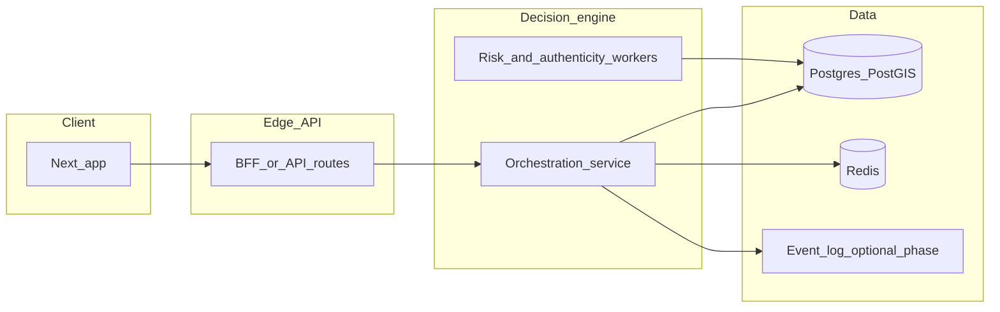

# Intelligent Layer — Summary of Understanding and Stack Direction

**Status:** Working alignment document for engineering and product.  
**Related:** [PRODUCT_ROADMAP.md](./PRODUCT_ROADMAP.md), [CITY_DECISION_ENGINE_STRATEGY.md](./CITY_DECISION_ENGINE_STRATEGY.md).

---

## 1. Pillar mapping (Royale One vs Intelligent Layer)

Royale One’s **product** pillars (go-to-market and suite scope) are not identical to the **decision-engine** pillars. Use this mapping so roadmap language and engine work stay consistent.

| Royale One product pillar | Role vs Intelligent Layer |
|---------------------------|---------------------------|
| **Orchestrated Mobility** | Hosts **Pillar 1 — Mobility Orchestration** (GTFS/GTFS-RT, traffic, hybrid modes, ranked options). This is where the real-time route decision engine lives first. |
| **Curated Habitation** | **Adjacent bounded context.** Stays and inventory use their own consistency model (see PRODUCT_ROADMAP §11.3). The **Authenticity** signals may inform *where* guests eat or go nearby, but booking and lodging OLTP are not collapsed into the mobility engine. |
| **Executive Foresight** | **Adjacent product.** Analytics, alerts, and B2B aggregates consume events and anonymized trends *downstream* of the engine—not a fourth duplicate of orchestration/risk/authenticity. |

| Intelligent Layer pillar | One-line intent |
|--------------------------|-----------------|
| **Mobility Orchestration** | Rank **how to move** (transit + road + inferred supply) with explicit time/cost/risk tradeoffs. |
| **Safety Risk Modeling** | Rank **where and how to move safely** (layers: official → crowdsourced → proxy), including safer paths vs shortest paths. |
| **Authenticity (“anti–tourist-trap”)** | Rank **places and experiences** using structural signals, not star ratings as the primary truth. |

**Confirmed:** The three **engine** pillars are **orchestration**, **risk / safe routing**, and **authenticity ranking**. They are **not** generic CRUD, a single ratings feed, or “one database for everything.”

---

## 2. North-star positioning

The product is **not** a generic map, OTA, or ride-hail clone. It is a **real-time decision layer**: given origin, destination, time, and preferences, the system **ranks options** (time, cost, risk, authenticity) and explains **why**—including safe-route and anti–tourist-trap explanations. Deep provider integrations and booking are **downstream**; the defensible wedge is **orchestration and judgment**, not blocking launch on every official API.

---

## 3. Pillar 1 — Mobility Orchestration

- **Intent:** Compare **public transit**, **road-based options** (with traffic), and **inferred taxi/VTC supply** (wait/price from history, time-of-day, zone—operator APIs optional at MVP).
- **Inputs:**
  - **Transit:** GTFS schedules + **GTFS-RT** where available (TMB Open Data).
  - **Roads:** Traffic APIs (e.g. Mapbox Traffic); **city open data** for closures, incidents, events where published.
  - **Supply signals:** Modeled estimates; first-party ride APIs not mandatory for v1.
- **Process:** Metro/bus paths, taxi-like estimates, walking and **hybrid** legs; normalize to comparable dimensions (duration, monetary cost, risk exposure).
- **Output:** **Ranked recommendations** with explicit tradeoffs (e.g. metro + walk vs taxi: minutes and euros saved). **MVP build order:** route decision engine first (see technical roadmap PDFs).

---

## 4. Pillar 2 — Safety Risk Modeling

- **Intent:** Prefer **lowest-risk path** where it matters; UX uses **confidence**, not alarmist copy (base route vs recommended route, subtle risk gradients).
- **Data stack (layered):**
  - **Layer 1:** Historical / official crime or safety proxies (**Open Data BCN** and related municipal data).
  - **Layer 2:** **User reports** (structured categories, e.g. suspicious activity, theft, crowded unsafe area).
  - **Layer 3 (later):** Proxy signals—crowd density, time patterns, event overlays (no single “crowd API” assumed).
- **Model shape:** Composite **risk_score**: area baselines + recency (e.g. recent reports) + density/event terms.
- **Product/engineering stance:** Outputs are **guidance with confidence**, not legal guarantees. Mitigate **legal** sensitivity of safety labeling, **GDPR**, and **estimation error** (see §8).

---

## 5. Pillar 3 — Authenticity algorithm (“anti–tourist trap”)

- **Intent:** Filter places and experiences using **behavioral and economic** signals, not star ratings as the primary signal.
- **De-emphasized:** Primary reliance on **Google / TripAdvisor-style** aggregate scores (treated as gameable in strategy).
- **Signals:**
  - Repeat engagement (e.g. repeat visits / repeat_score).
  - Local vs visitor behavior (local density, movement and time-of-day patterns; language only if privacy-preserving and lawful).
  - **Price authenticity:** vs **area median**; penalize deviation.
  - **Crowd stability:** penalize volatile spikes associated with traps.
- **Scoring reference (calibration target from technical roadmap PDF):**

  `authenticity_score = (0.35 * repeat_score) + (0.20 * local_movement_pattern) + (0.15 * time_pattern_match) + (0.10 * language_signal) - (0.20 * price_deviation)`  

  Weights are **starting points**; validate with data and policy.

- **Output:** Transparent explanations (e.g. local mix, pricing stability). **Filtering reality**, not only “recommending.”

### How this differs from TripAdvisor / Google

| Dimension | Typical ratings platforms | Intelligent Layer |
|-----------|---------------------------|-------------------|
| Primary signal | Stars and text reviews | Composite models: transit, traffic, risk, authenticity |
| Gaming | Incentivized reviews, SEO | Structural signals: repeat behavior, median price, volatility |
| User value | “What is rated high?” | “What should I do **now**?” — ranked **decisions** with tradeoffs |
| Mobility | Navigation or siloed apps | **Orchestrated** comparison across modes + **safe-route** option |

---

## 6. Technical constraints — TMB and Open Data BCN

**TMB / transit**

- **GTFS + GTFS-RT** are the operational contract: ingest, version, refresh on a schedule; **degrade gracefully** when RT is missing (static schedule + clear uncertainty in UX).
- Do **not** block launch on bespoke operator partnerships; approximation and honesty beat delay.

**Open Data BCN / municipal**

- Expect **heterogeneous formats, cadence, and coverage**—ETL must be **tolerant** and **observable** (freshness metrics, source timestamps).
- Crime/safety data often **district- or grid-level**—risk UX must respect **spatial granularity limits**.
- **GDPR / purpose limitation** for user reports and behavioral signals; prefer aggregates, thresholds, and minimal personal data for authenticity (goal: detect local patterns **without** unnecessary personal data).
- **Legal/product:** Avoid definitive “unsafe” claims; prefer **relative risk**, **confidence bands**, and counsel-approved disclaimers.

---

## 7. Recommended tech stack (v1 and scale path)

Aligned with [PRODUCT_ROADMAP.md](./PRODUCT_ROADMAP.md) §§11–16; avoid premature microservice sprawl.

| Layer | Recommendation | Rationale |
|-------|----------------|-----------|
| **Web / BFF** | **Next.js** ([apps/web](../apps/web)) | SSR, i18n, SEO; API Routes or thin BFF for auth and aggregation. |
| **Decision engine API** | **Node.js + TypeScript** (v1 default) | Same language as the web monorepo, shared types, one deploy/runtime story for orchestration; IO-bound routing and GTFS integration fit well. |
| **OLTP + geo** | **PostgreSQL + PostGIS** | Zones, incidents, reports, place metadata, route artifacts. |
| **Real-time / hot state** | **Redis** | Sessions, rate limits, short-lived caches; optional pub/sub for live ETAs later. |
| **Ingestion** | Scheduled **workers** + stored **raw GTFS** snapshots | Reproducibility, rollback, audit. |
| **Events (scale phase)** | **Kafka** or **Redis Streams** | When fan-out and replay matter; not mandatory for first route API—**event-ready schemas** early. |
| **Maps / traffic** | **Mapbox** (traffic) behind a **swappable** interface | Matches strategy sources. |
| **Live updates** | **SSE** first; **WebSockets** if bidirectional or high-frequency. | |
| **Observability** | **OpenTelemetry**, structured logs, metrics from first deployed engine | Needed to tune risk/authenticity under load. |

### Engine runtime decision (v1) — **TypeScript / Node**

**Chosen for v1:** **Node (TypeScript)** in the monorepo for the orchestration and API surface.

**Rationale:** Aligns with existing `apps/web` and `packages/*`; shared Zod/types; simpler hiring and CI; sufficient for MVP GTFS ingestion, routing orchestration, and PostGIS queries.

**When to introduce FastAPI (Python):** If a dedicated team owns **heavy offline ML**, notebook-driven calibration of authenticity/risk weights, or libraries that are Python-native, add a **small Python sidecar** or batch jobs for **training/scoring export**, not a second full API until the boundary is proven. Avoid two primary API languages on day one.

**Phasing discipline:** Ship **route decision engine → basic risk → simple authenticity**; keep **Curated Habitation** and **Executive Foresight** as **separate bounded contexts** so the Intelligent Layer does not absorb the whole suite.

---

## 8. Legal, safety labeling, and GDPR — pre-launch checklist

This section **does not** replace counsel. Mark items when **legal/product** has explicitly signed off.

**Safety and risk UX**

- [ ] Copy reviewed: no absolute claims (“guaranteed safe”); use relative risk / confidence language.
- [ ] Disclaimers and ToS/Privacy cross-links for map and route assistance features.
- [ ] Source attribution for official datasets (Open Data BCN, TMB) per license terms.
- [ ] Incident response: process if a user or authority disputes a risk classification.

**User-generated reports (Layer 2)**

- [ ] Lawful basis and purpose documented (GDPR Art. 6/9 as applicable).
- [ ] Retention and moderation policy defined; abuse and false-report handling.
- [ ] Minimization: what is stored (text, location granularity, user id vs anonymous).

**Authenticity and behavioral signals**

- [ ] DPIA or equivalent if processing location or behavioral patterns at scale.
- [ ] No covert profiling beyond disclosed purposes; opt-out where required.
- [ ] If language or demographic proxies are used, legal review for discrimination and GDPR fairness.

**Data processing agreements**

- [ ] Subprocessors (hosting, Mapbox, email) listed and contracted.

**Sign-off**

- [ ] Counsel name / date: _________________  
- [ ] DPO or owner name / date: _________________  

---

## 9. Alignment checklist (quick)

1. Three **engine** pillars: **orchestration**, **risk/safe routing**, **authenticity**—not generic CRUD or ratings-only products.
2. **TMB:** **GTFS / GTFS-RT** with graceful degradation when RT is absent.
3. **Open Data BCN:** official baselines + layered user/proxy signals with **privacy and legal** guardrails.
4. **Monetization posture (strategy):** non–transport-commission-first where possible—subscription, verified partners, B2B aggregates; avoid “Uber clone” regulatory positioning.

---

*Update this file when positioning, data sources, or stack choices change.*
